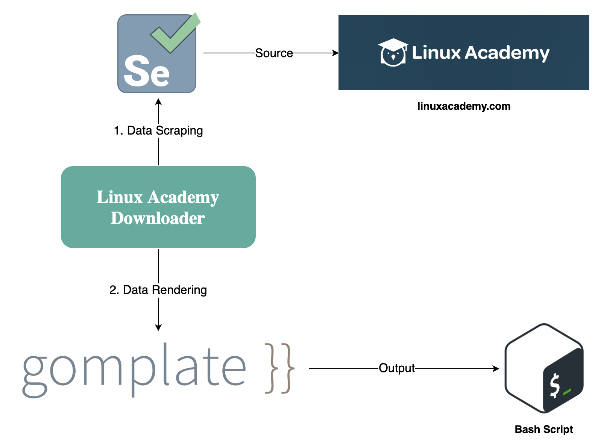

# Linux Academy Downloader

## Table of Contents

<!-- START doctoc generated TOC please keep comment here to allow auto update -->
<!-- DON'T EDIT THIS SECTION, INSTEAD RE-RUN doctoc TO UPDATE -->

- [How It Works](#how-it-works)
- [Requirements](#requirements)
- [Usage](#usage)

<!-- END doctoc generated TOC please keep comment here to allow auto update -->

## How It Works

## Requirements

These are mandatory dependencies that must be installed in your machine:

- [Node.js](https://nodejs.org/en/):
  a JavaScript runtime.
- [Chrome Driver](https://github.com/giggio/node-chromedriver):
  a WebDriver for automated testing of webapps on the Chrome browser.
- [youtube-dl](https://github.com/ytdl-org/youtube-dl):
  a command-line program to download videos from Linux Academy site.
- [gomplate](https://github.com/hairyhenderson/gomplate):
  a template renderer.

## Usage
